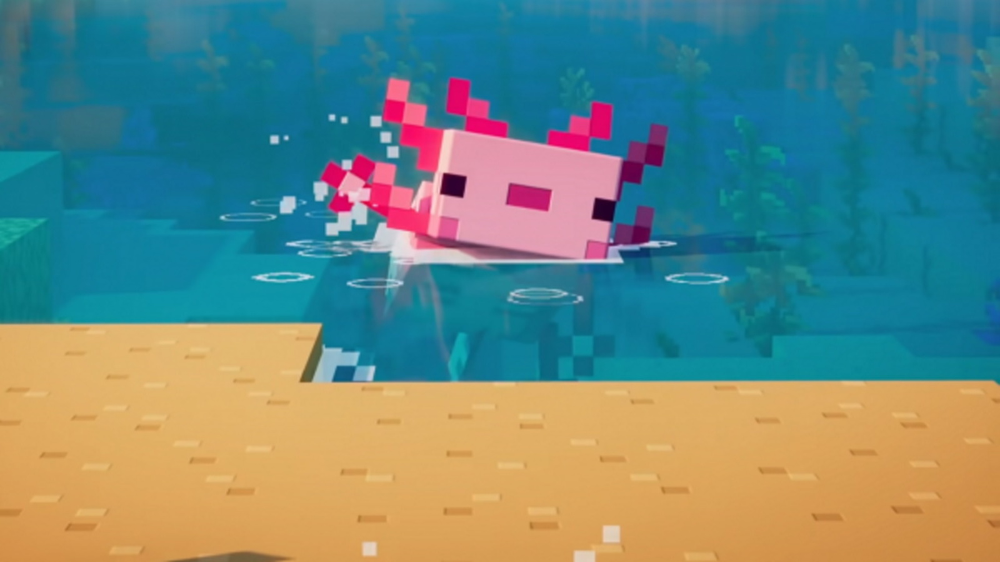

  

<h1>Hi, I'm Loghan 𓆩❤︎𓆪</h1>

**Also known as Caitlyn ✦₊˚ 🦋︎ ˚₊✦ online**

Minecraft mod developer • Linux server administrator • Electrical & Electronic Engineering student

**• 18yo • Malaysia 🇲🇾**

---

## About me

I develop **Fabric mods**, manage **modded Minecraft servers**, and enjoy troubleshooting technical problems involving **Java, Linux, cloud hosting, mods, and server configurations**.

I am currently completing my second year of a **Diploma in Electrical and Electronic Engineering** while continuing to build projects in Minecraft modding, robotics, embedded systems, and server administration.

> I make mods, break servers, read the logs, and fix them again.

  

---

## ✨ Featured projects

### 🥚 [Capture Egg](https://github.com/Ca1tlynRidley/capture-egg)

A Fabric 1.20.1 mod that lets players capture mobs—including bosses like the Wither—inside a reusable item and release them later.

**Highlights**

- Full NBT-based entity capture and release
- Preserves villager professions and trades
- Custom mixins for special interactions
- Dynamic tooltips, enchantment glint, and coloured display names
- Built with Java, Fabric, Mixin, Gradle, Git, and GitHub

### 💰 [BTD Shop & Sell](https://github.com/Ca1tlynRidley/BTD-Shop-Sell)

A Fabric 1.20.1 shop and selling mod powered by the Impactor economy system.

**Highlights**

- GUI-based `/shop` and `/sell` menus
- Item categories and configurable pricing
- Stack quantity controls
- Inventory validation
- Built with Java, Fabric, Gradle, Git, and GitHub

---

## 🛠️ Technical experience

### Minecraft

- Fabric mod development
- Modded server administration
- Datapacks and permissions
- Economy systems
- Crash-log analysis
- Compatibility troubleshooting

### Programming

- Java
- C++
- Python
- HTML and CSS
- PHP
- SQL

### Systems

- Ubuntu Linux
- SSH
- Windows and WSL
- AWS EC2
- Oracle Cloud
- Git and GitHub

### Engineering

- ESP32
- Robotics
- Digital electronics
- Circuit design
- AutoCAD
- Multisim

---

<table>
  <tr>
    <td width="72%" valign="top">
      <h2>🤖 Robotics</h2>
      <ul>
        <li>Current member of <strong>UMPBOT Club</strong></li>
        <li>Participated in the <strong>National Robotic League Competition from 2022 to 2025</strong></li>
        <li>Worked on <strong>sumo-robot</strong> and <strong>Jansen-linkage walking-robot</strong> concepts</li>
      </ul>
      <h2>🎯 Currently focusing on</h2>
      <ul>
        <li>Better Java architecture and code quality</li>
        <li>Data structures and computer engineering</li>
        <li>Minecraft mod development</li>
        <li>Embedded systems and robotics</li>
      </ul>
    </td>
    <td width="28%" align="center" valign="middle">
      
    </td>
  </tr>
</table>

---

## 🌐 Find me

---

**Thanks for visiting my profile!** 🐢
